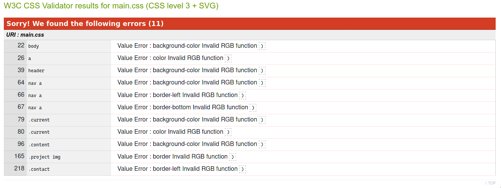

# Testing

## Code validators

[HTML Validator](https://validator.w3.org/):

All pages passed without errors and only one warning that was shared between all pages as it was in the shared Contact pane.

I decided to leave this warning as it was part of the embedded twitter element and was the HTML code provided by their documentation.

[CSS Validator](https://jigsaw.w3.org/css-validator/):

CSS validation threw one consistent error, all the result of the method I used to apply alpha transparency to colour variables. The colour had to be stored as a CSS variable which contained three seperate value (Red, Green, and Blue) which would be passed into an RGB or RGBA css function as required. While visually this has the desired effect the validator throws an error. You can read more about this implentation in the comments [here](assets/css/style.css).

## Responsiveness

Using both the Chrome and Firefox development tools I tested the project for responsiveness. I also tested the project physically on mobile througout development using the Live Server extension for VSCode.

|              | **index.html** | **publications.html** | **projects.html** | **blogs.html** |
| ------------ | :------------: | :-------------------: | :---------------: | :------------: |
| Desktop      |       ✅        |           ✅           |         ✅         |       ✅        |
| Laptop       |       ✅        |           ✅           |         ✅         |       ✅        |
| Galaxy S9    |       ✅        |           ✅           |         ✅         |       ✅        |
| iPad         |       ✅        |           ✅           |         ✅         |       ✅        |
| iPhone 5     |       ✅        |           ✅           |         ✅         |       ✅        |
| iPhone 6/7/8 |       ✅        |           ✅           |         ✅         |       ✅        |
| iPhone X/XS  |       ✅        |           ✅           |         ✅         |       ✅        |

<!-- Using HTML tag to resize large image -->

## Browser compatibility

Browsers tested:

- Firefox
- Chrome
- Edge
- Edge on Android

Having tested the project on these browsers I found no issues with responsiveness, appearance or functionality.

## Testing User stories

- General User Goals:
  - As a user, I want to get a general overview of the academic's achievements.
    - The **Home** page contains all the introductory details a user might want about the subject of the site.
  - As a user, I want to access the articles and blog posts of this academic.
    - The easy to access **Publications** and **Blogs** pages which are in the nav allow a user to read through the academic's published works available online.
  - As a user, I want to see what projects this academic is working on.
    - A user with a general interest in the academic's work can navigate to associated projects through the **Projects** page.

- Fellow Academic Goals:
  - As a fellow academic, access the Orlaith's twitter feed to network.
    - The embedded twitter feed in the **Contact panel** allows a fellow academic to see the three most recent tweets from the Academic, through this same feed they can access the Orlaith's twitter timeline and engage from there.
  - As a fellow academic, I want to get in contact and enquire about collaboration.
    - Both the academic's email and the email of a project she is heading is easily accessible on all pages using the **Contact panel**.

## Bugs

- As discussed previously the solution I used to apply an Alpha channel to a colour stored as a CSS variable threw an error in the validator. While the solution works visually and has the desired effect, a better solution I found uses PostCSS. As PostCSS is Javascript adjacent it's outside the scope of this project.
- While not necessarily a bug, I found during development that certain URLs were making my HTML files unwieldy. I opted to use bit.ly to shorten the URLs to make organising the source files easier.
- While validating the html files I discovered that I had left spaces in some og the file names which is undesirable, this was resolved by renaming the files.
- With the help of my mentor, I found a bug I never personally encountered during my testing on various browsers and devices. The twitter embedded timeline may fail to load. The way the timeline is implemented allows it to fail gracefully however, as if the twitter provided script doesn't load it remains as a link leading to the timeline on twitter itself.
- Some console warnings might also be thrown due to the twitter embedded timeline. As far as I can tell these are most likely caused by certain script blocking browser extensions.

[Return to README](README.md)
